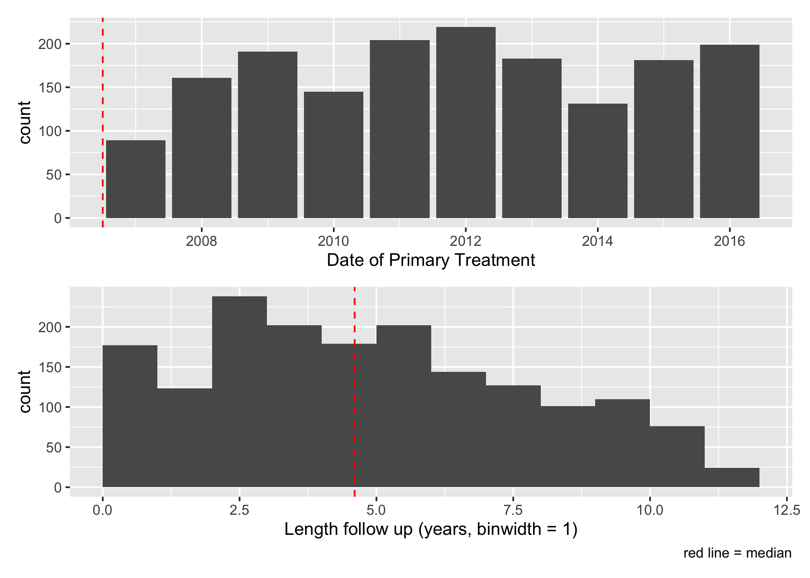
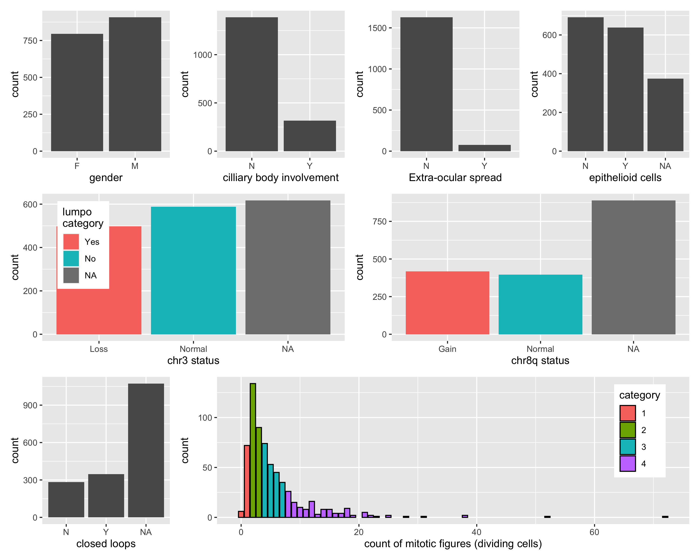
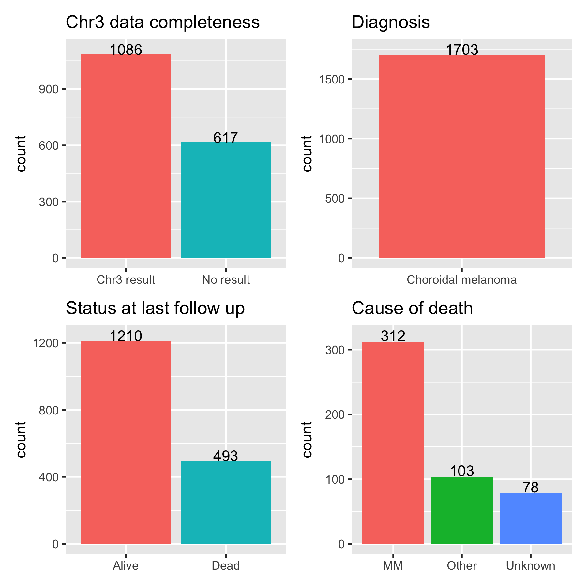
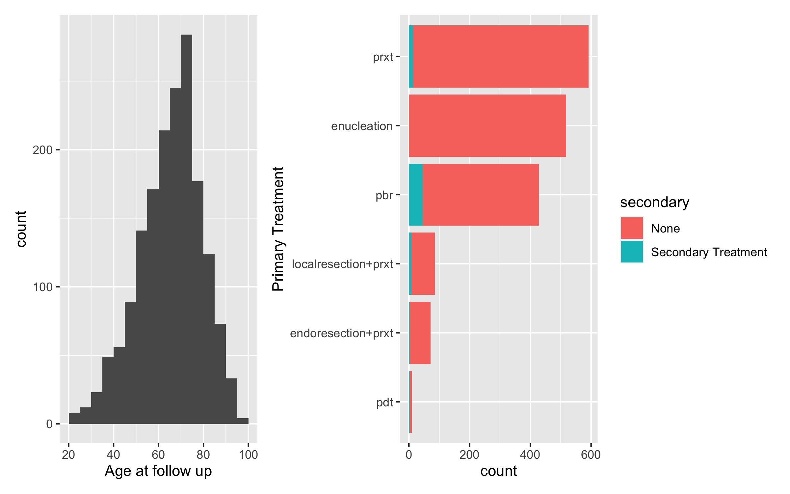
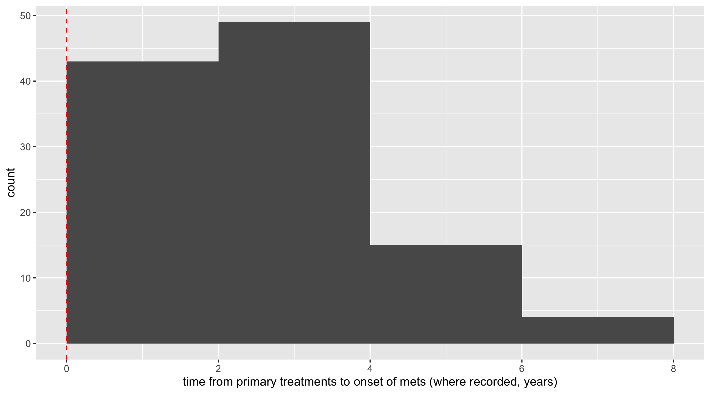

3_Check Quality
================
Helena
2023-03-13

## Check quality

This script makes plots with each of the columns in turn. If values and
distributions are a surprise this may indicate an unresolved data
quality issue

Load libraries and the dataset output by 2_clean

``` r
library(tidyverse)
library(lubridate)
library(here)
library(patchwork)

# Read in data
data <- readRDS(here("data", "processed_data.RDS"))
```

Look at the distribution of date of primary treatment and follow up.
Here we can see we only have people treated in the time period we expect
and that all follow up times are plausible and non-negative. We can see
the median follow up is just under 5 years.

``` r
##### Date of treatment and length follow up #########
plot_year <- data %>%
  ggplot(aes(dateofpmyear)) +
  geom_bar() +
  geom_vline(xintercept = 2006.5, color = "red", linetype = "dashed") +
  labs(x = "Date of Primary Treatment")

medianfu <- median(data$lfuyears)

plot_fu <- data %>%
  ggplot(aes(lfuyears)) +
  stat_bin(binwidth = 1, boundary = 0) +
  geom_vline(xintercept = medianfu, color = "red", linetype = "dashed", show.legend = T) +
  labs(x = "Length follow up (years, binwidth = 1)", caption = "red line = median")

plot_year + plot_fu + plot_layout(nrow = 2)
```

<!-- -->

Look at the plots for all the categorical inputs to LUMPO. All the
proportions shown here are broadly consistent with those reported in
previous studies, so there is no cause for concern.

``` r
gender <- data %>% ggplot(aes(gender)) +
  geom_bar()

cbi <- data %>% ggplot(aes(cbi)) +
  geom_bar() +
  labs(x = "cilliary body involvement")

eospread <- data %>% ggplot(aes(eospread)) +
  geom_bar() +
  labs(x = "Extra-ocular spread")

epi <- data %>% ggplot(aes(epithelioid)) +
  geom_bar() +
  labs(x = "epithelioid cells")

loops <- data %>%
  ggplot(aes(loops)) +
  geom_bar() +
  labs(x = "closed loops")

mitcount <- data %>%
  mutate(mitcountcat = if_else(mitcount < 2, 1, if_else(mitcount < 4, 2, if_else(mitcount < 8, 3, 4))),
         mitcountcat = as.factor(mitcountcat)) %>%
  ggplot(aes(mitcount, fill = mitcountcat)) +
  geom_bar(color = "black") +
  labs(x = "count of mitotic figures (dividing cells)", fill = "category") +
  theme(legend.justification = c("right", "top"),
        legend.position = c(0.95, 0.95))

chr3 <- data %>%
  mutate(chr3fill = case_when(chr3 == "G" | chr3 == "N" ~ "No",
                              chr3 == "L" ~ "Yes"),
         chr3fill = factor(chr3fill, levels = c("Yes", "No"))) %>%
  mutate(chr3 = case_when(chr3 == "G" ~ "Gain",
                          chr3 == "L" ~ "Loss",
                          chr3 == "N" ~ "Normal",
                          chr3 == "U" ~ "Unclassified")) %>%
  ggplot(aes(chr3, fill = chr3fill)) +
  geom_bar(show.legend = T) +
  labs(x = "chr3 status", fill = "lumpo\ncategory") +
  theme(legend.justification = c("left", "top"),
        legend.position = c(0.05, 0.95))

chr8q <- data %>%
  mutate(chr8qfill = case_when(chr8q == "L" | chr8q == "N" ~ "No",
                               chr8q == "G" ~ "Yes"),
         chr8qfill = factor(chr8qfill, levels = c("Yes", "No"))) %>%
  mutate(chr8q = case_when(chr8q == "G" ~ "Gain",
                           chr8q == "L" ~ "Loss",
                           chr8q == "N" ~ "Normal",
                           chr8q == "U" ~ "Unclassified")) %>%
  ggplot(aes(chr8q, fill = chr8qfill)) +
  geom_bar(show.legend = F) +
  labs(x = "chr8q status", fill = "lumpo\ncategory") +
  theme(legend.justification = c("left", "top"),
        legend.position = c(0.05, 0.95))

layout1 <- "
AABBCCDD
FFFFGGGG
EEHHHHHH
"

gender + cbi + eospread + epi + loops + chr3 + chr8q + mitcount + plot_layout(design = layout1)
```

<!-- -->

Plotting histograms of the continuous variables which are inputs to
LUMPO also shows distributions that are consistent with previous
reports. However, the plots do show clearly that the limits (red dashed
lines) imposed on entries to the website exclude many relevant values. I
recommended the website was changed to allow input of all valid values
represented in the data.

``` r
ageatpm <- data %>%
  ggplot(aes(ageatpm)) +
  stat_bin(binwidth = 5, boundary = 0) +
  geom_vline(xintercept = 30, color = "red", linetype = "dashed") +
  geom_vline(xintercept = 79, color = "red", linetype = "dashed") +
  scale_x_continuous(breaks = seq(0, 100, 10)) +
  labs(x = "Age at prim. treatment")

lbd <- data %>%
  ggplot(aes(lbd)) +
  stat_bin(binwidth = 1, boundary = 0) +
  geom_vline(xintercept = 1, color = "red", linetype = "dashed") +
  geom_vline(xintercept = 20.9, color = "red", linetype = "dashed") +
  labs(x = "diameter (mm)")

uh <- data %>%
  ggplot(aes(uh)) +
  stat_bin(binwidth = 1, boundary = 0) +
  geom_vline(xintercept = 1, color = "red", linetype = "dashed") +
  geom_vline(xintercept = 15.9, color = "red", linetype = "dashed") +
  labs(x = "height (mm)")

ageatpm + lbd + uh
```

<!-- -->

Further plots show that diagnosis, status and cause of death only
contain the values we would expect

``` r
genetics <- data %>% ggplot(aes(with3, fill = with3)) +
  geom_bar(show.legend = F) +
  geom_text(stat = "count", aes(label = ..count..), nudge_y = 25) +
  labs(x = NULL, title = "Chr3 data completeness")

diagnosis <- data %>% ggplot(aes(diagnosis, fill = diagnosis)) +
  geom_bar(show.legend = F) +
  geom_text(stat = "count", aes(label = ..count..), nudge_y = 45) +
  labs(x = NULL, title = "Diagnosis")

status <- data %>%
  mutate(status = if_else(status == "A", "Alive", "Dead")) %>%
  ggplot(aes(status, fill = status)) +
  geom_bar(show.legend = F) +
  geom_text(stat = "count", aes(label = ..count..), nudge_y = 35) +
  labs(x = NULL, title = "Status at last follow up")

cod <- data %>%
  filter(!is.na(causeofdeath)) %>%
  ggplot(aes(causeofdeath, fill = causeofdeath)) +
  geom_bar(show.legend = F) +
  geom_text(stat = "count", aes(label = ..count..), nudge_y = 10) +
  labs(x = NULL, title = "Cause of death")

genetics + diagnosis + status + cod
```

<!-- -->

Calculating age at follow up is one way of checking whether the death
notifications data is reliable. We can see that no-one is implausibly
old, which may happen if death notifications were failing to be
recorded. We can see we only have the standard types of primary
treatment.

``` r
agefu <- data %>%
  mutate(agefu = ageatpm + (dateofpm %--% followup / dyears(1))) %>%
  ggplot(aes(agefu)) +
  stat_bin(binwidth = 5, boundary = 0) +
  labs(x = "Age at follow up")

treatment <- data %>%
  ggplot(aes(fct_rev(fct_infreq(primarytreatment)), fill = secondary)) +
  geom_bar() +
  coord_flip() +
  labs(x = "Primary Treatment")

agefu + treatment
```

<!-- -->

Similarly, calculating time interval between primary tretament and mets
detection (where recorded) shows no-one has mets detected before
treatment (which we would exclude from this present study)

``` r
data %>%
  ggplot(aes(lfumets)) +
  stat_bin(binwidth = 2, boundary = 0) +
  geom_vline(xintercept = 0, color = "red", linetype = "dashed") +
  labs(x = "time from primary treatments to onset of mets (where recorded, years)")
```

<!-- -->

If everything is as expected in the above plots we can move onto
4_wrangle. If problems are showing in the plots, the reason for these
needs to be established and further work needs to be done in the
cleaning script (2_clean).
