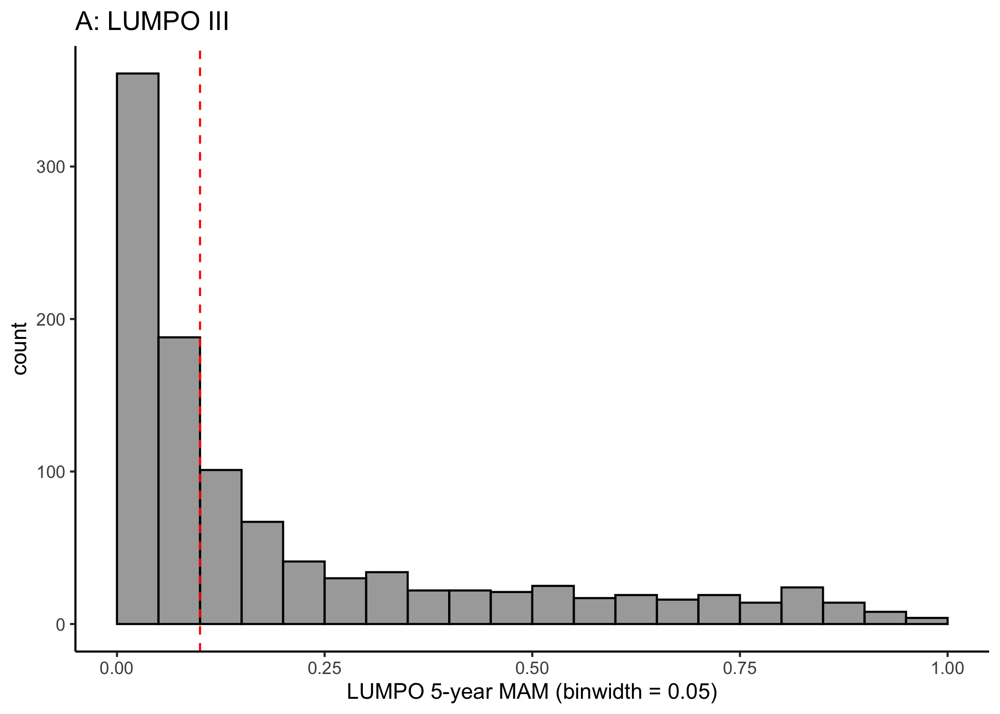

Analysis
================
Helena
2023-02-27

### Purpose of this document

This is intended to explain the analytic code for the paper ‘Sensitivity
and specificity of different prognostic systems when used to stratify
for surveillance in a population of uveal melanoma patients’. I would
recommend reading the paper before trying to understand the code. There
is an R script called ‘Analysis’ in the ‘scripts’ folder. Running that
script produces all the plots and summaries that are in the paper. This
document walks through the code in that script. The data is
pseudonimised but not publicly available because it is sensitive data
and there is a danger of re-identification.

This code loads all the required packages, custom functions and the
dataset:

``` r
library(tidyverse)
library(lubridate)
library(plotROC)
library(ROCit)
library(patchwork)
library(scales)
library(here)
library(PropCIs)
source(here("scripts", "Functions.R"))

roc_data <- readRDS(here("data", "roc_data.RDS"))
```

At this point the dataset has been prepared for analysis. The
preparation steps will be addressed in a separate markdown file. The
data should now look like this (the following example data is made up):

``` r
glimpse(fake_roc_data)
```

    ## Rows: 4
    ## Columns: 20
    ## $ rowid            <dbl> 1, 2, 3, 4
    ## $ ageatpm          <dbl> 57, 68, 44, 86
    ## $ gender           <chr> "M", "M", "F", "M"
    ## $ primarytreatment <fct> enucleation, pbr, enucleation, plaque radiotherapy
    ## $ epithelioid      <chr> "Y", "N", "N", "N"
    ## $ loops            <chr> "N", "Y", "N", "N"
    ## $ mitcount         <dbl> 3, 2, 6, 1
    ## $ lbd              <dbl> 10.1, 2.5, 6.7, 11.6
    ## $ uh               <dbl> 1.5, 1.1, 2.1, 2.2
    ## $ cbi              <chr> "N", "Y", "N", "N"
    ## $ eospread         <chr> "Y", "N", "N", "N"
    ## $ status           <chr> "A", "D", "A", "D"
    ## $ causeofdeath     <fct> NA, Other, NA, MM
    ## $ chr3             <chr> "L", "N", "N", "L"
    ## $ chr8q            <chr> "G", "N", "N", "G"
    ## $ MM               <dbl> 0.555, 0.031, 0.101, 0.657
    ## $ score            <dbl> 56, 12, 12, 70
    ## $ stage            <chr> "IIB", "I", "IIA", "IIIA"
    ## $ outcome          <chr> "No mets", "No mets", "No mets", "Mets"
    ## $ outcome_binary   <dbl> 0, 0, 0, 1

NOTE: cols ‘MM’ is the LUMPO 5 year MAM and ‘score’ is the LPM 5 year
MAM. I agree I could’ve called them something more helpful.

One last preparation step - the risk score output from LPM is from 0-100
rather than between 0-1. It needs to be the latter for the ROC analysis
plots and functions that come later. This is why it gets divided by 100.

``` r
roc_data <- roc_data %>%
  mutate(
    score = score / 100,
  )
```

### Table 2: Descriptive statistics

This is all self-explanatory so I’ve just included a few example lines
and all the outputs went into Table 2 of the paper.I used either
count(), median(), or range() for each column as appropriate. Note that
all the counts, medians and ranges are all consistent with previously
published estimates so don’t raise any data quality concerns.

``` r
roc_data %>%
  count(outcome)
```

    ##   outcome   n
    ## 1    Mets 292
    ## 2 No mets 755

``` r
median(roc_data$ageatpm)
```

    ## [1] 61

``` r
range(roc_data$ageatpm)
```

    ## [1] 18 94

### Figure 1: Distribution plots

These plots show the distribution of risk scores / categories in the
dataset under the four different prognostic systems with red dashed
lines showing example cut-offs which could be used to stratify into high
and low risk for enrollment in surveillance. Only LUMPO and AJCC are
shown in the paper due to space.

``` r
lumpo_dist <- roc_data %>%
  ggplot(aes(MM)) +
  stat_bin(binwidth = 0.05, boundary = 0, color = "black", fill = "black", alpha = 0.4) +
  labs(
    x = "LUMPO 5-year MAM (binwidth = 0.05)",
    title = "A: LUMPO III"
  ) +
  theme_classic()

lumpo_dist
```

<!-- -->

``` r
ajcc_dist <- roc_data %>%
  mutate(stage = factor(stage, levels = c("I", "IIA", "IIB", "IIIA", "IIIB", "IIIC"))) %>%
  ggplot(aes(stage)) +
  geom_bar(color = "purple", fill = "purple", alpha = 0.5) +
  labs(title = "B: AJCC stage") +
  theme_classic()

ajcc_dist
```

<!-- -->

``` r
roc_data %>%
  ggplot(aes(score)) +
  stat_bin(binwidth = 0.1, boundary = 0, color = "darkgoldenrod", fill = "#E69F00") +
  labs(
    x = "LPM 5-year MAM (binwidth = 0.1)",
    title = "C: LPM"
  ) +
  theme_classic()
```

<!-- -->

``` r
bar_chr3 <- roc_data %>%
  mutate(
    chr3 = if_else(chr3 == "L", "Monosomy", "Disomy"),
    chr3 = if_else(is.na(chr3), "Unknown", chr3)
  ) %>%
  ggplot(aes(chr3)) +
  geom_bar(color = "pink3", fill = "pink") +
  labs(x = "Chromosome 3 status", title = "D: Genetics") +
  theme_classic()

bar_chr3
```

<!-- -->

### Table 3: Stratify the dataset into high and low risk categories

Stratifying the dataset means deciding on a cutoff value above which
patients are classified as ‘high-risk’ and therefore enrolled in
surveillance. In the example below, all patients to the right of the red
dashed line are considered high-risk.

<!-- -->

The following chunk creates a table of sensitivity and specificity
estimates etc at different LUMPO cut-off values. In the script the same
table gets produced for LPM. These tables produce the figures for Table
3 in the paper. You can look at different cut-offs by changing the
figures included in the ‘cut-off’ column). calc_prevalence and ci_prev
are custom functions in the Functions.R script.

``` r
prevalence <- calc_prevalence(roc_data)
ci_prev <- calc_ci_prev(roc_data)

cuts_tibble_mm <- tibble(cutoff = c(0.5, 0.3, 0.2, 0.1, 0.05)) %>% # LUMPO
  rowwise() %>%
  mutate(
    sensitivity = calc_sens1(roc_data, MM, cutoff),
    specificity = calc_spec1(roc_data, MM, cutoff),
    TP = prevalence * sensitivity,
    TN = (1 - prevalence) * specificity,
    FN = prevalence - TP,
    FP = (1 - prevalence) - TN,
    NPV = TN / (TN + FN),
    PPV = TP / (FP + TP),
    surveillance = TP + FP,
    sens_lower = calc_sens_ci1(roc_data, MM, cutoff)[[1]][1],
    sens_upper = calc_sens_ci1(roc_data, MM, cutoff)[[1]][2],
    spec_lower = calc_spec_ci1(roc_data, MM, cutoff)[[1]][1],
    spec_upper = calc_spec_ci1(roc_data, MM, cutoff)[[1]][2],
    inv_spec = 1 - specificity,
    inv_spec_upper = 1 - spec_upper,
    inv_spec_lower = 1 - spec_lower
  )

cuts_tibble_mm
```

    ## # A tibble: 5 × 17
    ## # Rowwise: 
    ##   cutoff sensitivity specificity    TP    TN     FN     FP   NPV   PPV
    ##    <dbl>       <dbl>       <dbl> <dbl> <dbl>  <dbl>  <dbl> <dbl> <dbl>
    ## 1   0.5        0.442       0.959 0.123 0.691 0.156  0.0296 0.816 0.806
    ## 2   0.3        0.634       0.902 0.177 0.650 0.102  0.0707 0.864 0.714
    ## 3   0.2        0.75        0.850 0.209 0.613 0.0697 0.108  0.898 0.660
    ## 4   0.1        0.880       0.678 0.245 0.489 0.0334 0.232  0.936 0.514
    ## 5   0.05       0.952       0.458 0.266 0.330 0.0134 0.391  0.961 0.405
    ## # … with 8 more variables: surveillance <dbl>, sens_lower <dbl>,
    ## #   sens_upper <dbl>, spec_lower <dbl>, spec_upper <dbl>, inv_spec <dbl>,
    ## #   inv_spec_upper <dbl>, inv_spec_lower <dbl>

I did this a bit differently for AJCC because it’s split into categories
rather than a continuous score. For each of the cut-offs (red dashed
lines) displayed below I’ve added a column to the dataset with the
categorisation for each patient under the system, then made a summary
table for that column. (Yes, this is a bit long winded and there is
probably a better way)

<!-- -->

``` r
roc_data <- roc_data %>%
  mutate(
    stage_2a = if_else(stage %in% c("I"), "No surveillance", "Surveillance"),
    stage_2b = if_else(stage %in% c("I", "IIA"), "No surveillance", "Surveillance"),
    stage_3a = if_else(stage %in% c("I", "IIA", "IIB"), "No surveillance", "Surveillance")
  )

stage2a_tibble <- tibble(
  sensitivity = calc_sens2(roc_data, stage_2a),
  specificity = calc_spec2(roc_data, stage_2a),
  TP = prevalence * sensitivity,
  TN = (1 - prevalence) * specificity,
  FN = prevalence - TP,
  FP = (1 - prevalence) - TN,
  NPV = TN / (TN + FN),
  PPV = TP / (FP + TP),
  surveillance = TP + FP,
  sens_lower = calc_sens_ci2(roc_data, stage_2a)[[1]][1],
  sens_upper = calc_sens_ci2(roc_data, stage_2a)[[1]][2],
  spec_lower = calc_spec_ci2(roc_data, stage_2a)[[1]][1],
  spec_upper = calc_spec_ci2(roc_data, stage_2a)[[1]][2],
  inv_spec = 1 - specificity,
  inv_spec_upper = 1 - spec_upper,
  inv_spec_lower = 1 - spec_lower
  )

stage2a_tibble
```

    ## # A tibble: 1 × 16
    ##   sensitivity specificity    TP    TN     FN    FP   NPV   PPV surveillance
    ##         <dbl>       <dbl> <dbl> <dbl>  <dbl> <dbl> <dbl> <dbl>        <dbl>
    ## 1       0.945       0.375 0.264 0.270 0.0153 0.451 0.946 0.369        0.714
    ## # … with 7 more variables: sens_lower <dbl>, sens_upper <dbl>,
    ## #   spec_lower <dbl>, spec_upper <dbl>, inv_spec <dbl>, inv_spec_upper <dbl>,
    ## #   inv_spec_lower <dbl>

Lastly, for the monosomy 3 system I again add a column (m3_str) to the
dataset classifying each patient. If a patient has monosomy 3 (‘L’) or
no chromosome 3 result they are placed in the ‘Surveillance’ category.
This method of classifying was based on a description of current
practice at LOOC. Again this is summarised in a table.

``` r
bar_chr3 +
  geom_vline(xintercept = 1.5, color = "red", linetype = "dashed")
```

<!-- -->

``` r
roc_data <- roc_data %>%
  mutate(
    m3_str = if_else(chr3 == "L" | is.na(chr3), "Surveillance", "No surveillance")
  )

m3_tibble <- tibble(
  sensitivity = calc_sens2(roc_data, m3_str),
  specificity = calc_spec2(roc_data, m3_str),
  TP = prevalence * sensitivity,
  TN = (1 - prevalence) * specificity,
  FN = prevalence - TP,
  FP = (1 - prevalence) - TN,
  NPV = TN / (TN + FN),
  PPV = TP / (FP + TP),
  surveillance = TP + FP,
  sens_lower = calc_sens_ci2(roc_data, m3_str)[[1]][1],
  sens_upper = calc_sens_ci2(roc_data, m3_str)[[1]][2],
  spec_lower = calc_spec_ci2(roc_data, m3_str)[[1]][1],
  spec_upper = calc_spec_ci2(roc_data, m3_str)[[1]][2]
) %>%
  mutate(
    inv_spec = 1 - specificity,
    inv_spec_upper = 1 - spec_upper,
    inv_spec_lower = 1 - spec_lower
  )
```

### ROC Analysis: Calculate AUCs with cis

The AUCs relate to the ROC curves in figure 2 and are given in the text
of the paper.

``` r
roc_lumpo <- rocit(
  score = roc_data$MM,
  class = roc_data$outcome, negref = "No mets"
)
paste("roc_data lumpo", auc_label(roc_lumpo))
```

    ## [1] "roc_data lumpo AUC = 0.88 ( 0.85 - 0.9 )"

### Figure 2

To make the plots that have the roc curves as well as labelled point
estimates I’ve used geom_roc, then overlaid points, labels and
confidence intervals as annotations because ggplot2 doesn’t support the
combination of points and roc curves (which is why the code for it is so
long!). If you can show me a better way I will buy you a coffee.

``` r
longdata <- melt_roc(roc_data, "outcome_binary", c("MM", "score")) %>%
  mutate(
    name = if_else(name == "MM", "LUMPO III", "LPM"),
    name = factor(name, levels = c("LUMPO III", "LPM"))
  )

fig2 <- ggplot(longdata, aes(d = D, m = M, color = name)) +
  scale_color_manual(values = c("black", "#E69F00")) +
  annotate(
    geom = "rect", xmin = m3_tibble$inv_spec_upper, xmax = m3_tibble$inv_spec_lower, ymin = m3_tibble$sens_lower, ymax = m3_tibble$sens_upper,
    fill = "pink", alpha = 0.5
  ) +
  annotate(
    geom = "rect", xmin = stage2a_tibble$inv_spec_upper, xmax = stage2a_tibble$inv_spec_lower, ymin = stage2a_tibble$sens_lower, ymax = stage2a_tibble$sens_upper,
    fill = "purple", alpha = 0.5
  ) +
  annotate(
    geom = "rect", xmin = stage2b_tibble$inv_spec_upper, xmax = stage2b_tibble$inv_spec_lower, ymin = stage2b_tibble$sens_lower, ymax = stage2b_tibble$sens_upper,
    fill = "purple", alpha = 0.5
  ) +
  annotate(
    geom = "rect", xmin = stage3a_tibble$inv_spec_upper, xmax = stage3a_tibble$inv_spec_lower, ymin = stage3a_tibble$sens_lower, ymax = stage3a_tibble$sens_upper,
    fill = "purple", alpha = 0.5
  ) +
  annotate(
    geom = "rect", xmin = cuts_tibble_mm$inv_spec_upper[1], xmax = cuts_tibble_mm$inv_spec_lower[1],
    ymin = cuts_tibble_mm$sens_lower[1], ymax = cuts_tibble_mm$sens_upper[1],
    fill = "black", alpha = 0.4
  ) +
  annotate(
    geom = "rect", xmin = cuts_tibble_mm$inv_spec_upper[3], xmax = cuts_tibble_mm$inv_spec_lower[3],
    ymin = cuts_tibble_mm$sens_lower[3], ymax = cuts_tibble_mm$sens_upper[3],
    fill = "black", alpha = 0.4
  ) +
  annotate(
    geom = "rect", xmin = cuts_tibble_mm$inv_spec_upper[4], xmax = cuts_tibble_mm$inv_spec_lower[4],
    ymin = cuts_tibble_mm$sens_lower[4], ymax = cuts_tibble_mm$sens_upper[4],
    fill = "black", alpha = 0.4
  ) +
  annotate(
    geom = "rect", xmin = cuts_tibble_mm$inv_spec_upper[5], xmax = cuts_tibble_mm$inv_spec_lower[5],
    ymin = cuts_tibble_mm$sens_lower[5], ymax = cuts_tibble_mm$sens_upper[5],
    fill = "black", alpha = 0.4
  ) +
  geom_roc(n.cuts = 0, labels = FALSE) +
  labs(x = "1-specificity", y = "sensitivity") +
  geom_point(x = 1 - m3_tibble$specificity, y = m3_tibble$sensitivity, color = "#F8766D") +
  geom_point(x = stage2a_tibble$inv_spec, y = stage2a_tibble$sensitivity, color = "purple") +
  geom_point(x = stage2b_tibble$inv_spec, y = stage2b_tibble$sensitivity, color = "purple") +
  geom_point(x = stage3a_tibble$inv_spec, y = stage3a_tibble$sensitivity, color = "purple") +
  geom_point(x = cuts_tibble_mm$inv_spec[1], y = cuts_tibble_mm$sensitivity[1], color = "black") +
  annotate("text",
    x = cuts_tibble_mm$inv_spec[1] - 0.05, y = cuts_tibble_mm$sensitivity[1],
    label = cuts_tibble_mm$cutoff[1], size = 4
  ) +
  geom_point(x = cuts_tibble_mm$inv_spec[3], y = cuts_tibble_mm$sensitivity[3], color = "black") +
  annotate("text",
    x = cuts_tibble_mm$inv_spec[3] - 0.06, y = cuts_tibble_mm$sensitivity[3],
    label = cuts_tibble_mm$cutoff[3], size = 4
  ) +
  geom_point(x = cuts_tibble_mm$inv_spec[4], y = cuts_tibble_mm$sensitivity[4], color = "black") +
  annotate("text",
    x = cuts_tibble_mm$inv_spec[4], y = cuts_tibble_mm$sensitivity[4] + 0.06,
    label = cuts_tibble_mm$cutoff[4], size = 4
  ) +
  geom_point(x = cuts_tibble_mm$inv_spec[5], y = cuts_tibble_mm$sensitivity[5], color = "black") +
  annotate("text",
    x = cuts_tibble_mm$inv_spec[5], y = cuts_tibble_mm$sensitivity[5] + 0.05,
    label = cuts_tibble_mm$cutoff[5], size = 4
  ) +
  annotate("text",
    x = stage2a_tibble$inv_spec + 0.13, y = stage2a_tibble$sensitivity, label = ">= IIA", size = 4,
    color = "mediumorchid4"
  ) +
  annotate("text",
    x = stage2b_tibble$inv_spec + 0.13, y = stage2b_tibble$sensitivity, label = ">= IIB", size = 4,
    color = "mediumorchid4"
  ) +
  annotate("text",
    x = stage3a_tibble$inv_spec + 0.13, y = stage3a_tibble$sensitivity, label = ">= IIIA", size = 4,
    color = "mediumorchid4"
  ) +
  geom_point(x = 0.68, y = 0.08, color = "#F8766D") +
  annotate("text", x = 0.9, y = 0.08, label = "Monosomy 3", size = 3) +
  geom_point(x = 0.68, y = 0.03, color = "purple") +
  annotate("text", x = 0.9, y = 0.03, label = "AJCC system", size = 3) +
  theme_classic() +
  theme(legend.position = c(0.8, 0.25)) +
  theme(legend.title = element_blank()) +
  theme(legend.background = element_blank())

fig2
```

<!-- -->

### Splitting the data into two different subpopulations

Chromosome 3 is an important prognostic factor in LPM and LUMPO and a
non-random subset of patients do not have a chromosome 3 result
(discussed in paper). Therefore I wanted to consider the performance of
the models on each subpopulation separately. This code splits the
dataset into these two subpopulations.

``` r
roc_data <- roc_data %>%
  mutate(
    with3 = as_factor(if_else(is.na(chr3), "No result", "Chr3 result")),
    area = lbd * uh,
  )

roc_data2 <- roc_data %>%
  filter(with3 == "Chr3 result")

roc_data3 <- roc_data %>%
  filter(with3 != "Chr3 result")
```

The differences between these two subpopulations are summarised in
figure s3

``` r
prevalence2 <- calc_prevalence(roc_data2)
ci_prev2 <- calc_ci_prev(roc_data2)

prevalence3 <- calc_prevalence(roc_data3)
ci_prev3 <- calc_ci_prev(roc_data3)

prev_tibble <- tibble(
  subpopulation = c("Chr3 result", "No result"),
  prevalence = c(prevalence2, prevalence3),
  prev_low = c(ci_prev2[[1]][[1]], ci_prev3[[1]][[1]]),
  prev_high = c(ci_prev2[[1]][[2]], ci_prev3[[1]][[2]])
)

figs3a <- prev_tibble %>% ggplot(aes(x = subpopulation, y = prevalence, ymax = prev_high, ymin = prev_low)) +
  geom_bar(stat = "identity") +
  geom_errorbar(width = 0.1) +
  scale_y_continuous(limits = c(0, 1)) +
  theme_classic() +
  labs(title = "A: Prevalence of outcome")

figs3b <- roc_data %>%
  ggplot(aes(with3, area)) +
  geom_boxplot() +
  labs(x = NULL, y = "tumour size (mm^2)", title = "B: Tumour size in subpopulations") +
  theme_classic()

figs3a + figs3b
```

<!-- -->

All the code discussed previously is repeated for roc_data2 and
roc_data3 to result in figure 3.

### Figure 4: LUMPO strategy with different cut-offs for two subpopulations

Given that LUMPO and LPM are less accurate without a chromosome 3
result, it was decided that a more conservative cut-off should be used
so that high sensitvity is maintained for patients lacking chromosome 3.
The following code applies a different cut-off depending on whether a
chromosome 3 result is present, then summarises that sensitvty and
specificity of this strategy overall.

``` r
roc_data <- roc_data %>% mutate(
  fig4_str = case_when(is.na(chr3) & MM >= 0.045 ~ "Surveillance",
                       is.na(chr3) & MM < 0.045 ~ "No surveillance",
                       !is.na(chr3) & MM >= 0.07 ~ "Surveillance",
                       !is.na(chr3) & MM < 0.07 ~ "No surveillance")
)

fig4_lumpo <- tibble(sensitivity = calc_sens2(roc_data, fig4_str),
                     specificity = calc_spec2(roc_data, fig4_str),
                     TP = prevalence * sensitivity,
                     TN = (1 - prevalence) * specificity,
                     FN = prevalence - TP,
                     FP = (1 - prevalence) - TN,
                     NPV = TN / (TN + FN),
                     PPV = TP / (FP + TP),
                     surveillance = TP + FP,
                     sens_lower = calc_sens_ci2(roc_data, fig4_str)[[1]][1],
                     sens_upper = calc_sens_ci2(roc_data, fig4_str)[[1]][2],
                     spec_lower = calc_spec_ci2(roc_data, fig4_str)[[1]][1],
                     spec_upper = calc_spec_ci2(roc_data, fig4_str)[[1]][2]) %>%
  mutate(inv_spec = 1 - specificity,
         inv_spec_upper = 1 - spec_upper,
         inv_spec_lower = 1 - spec_lower)

# Plot 3 strategies
strategies <- tibble(
  strategy = factor(c("LUMPO III" ,"Monosomy 3", "AJCC"), levels = c("LUMPO III" ,"Monosomy 3", "AJCC")),
  sensitivity = c(fig4_lumpo$sensitivity, m3_tibble$sensitivity, stage2a_tibble$sensitivity),
  specificity = c(fig4_lumpo$specificity, m3_tibble$specificity, stage2a_tibble$specificity),
  sens_upper = c(fig4_lumpo$sens_upper, m3_tibble$sens_upper, stage2a_tibble$sens_upper),
  sens_lower = c(fig4_lumpo$sens_lower, m3_tibble$sens_lower, stage2a_tibble$sens_lower),
  spec_upper = c(fig4_lumpo$spec_upper, m3_tibble$spec_upper, stage2a_tibble$spec_upper),
  spec_lower = c(fig4_lumpo$spec_lower, m3_tibble$spec_lower, stage2a_tibble$spec_lower)
) %>%
  mutate(
    inv_spec = 1 - specificity,
    inv_spec_upper = 1 - spec_upper,
    inv_spec_lower = 1 - spec_lower
  )

strategies %>% ggplot(aes(x = inv_spec, y = sensitivity)) +
  geom_hline(aes(yintercept = 0.95), linetype = "dashed", color = "grey", alpha = 0.5) +
  geom_rect(aes(xmin = inv_spec_upper, xmax = inv_spec_lower, ymin = sens_lower,
                ymax = sens_upper, fill = strategy), alpha = 0.5) +
  geom_point(aes(color = strategy)) +
  geom_abline(aes(intercept = 0, slope = 1), color = "white") +
  scale_x_continuous("1-specificity", limits = c(0, 1)) +
  scale_y_continuous("sensitivity", limits = c(0, 1)) +
  scale_color_manual(values = c("black", "#F8766D", "purple")) +
  scale_fill_manual(values = c("black", "pink", "purple")) +
  theme(legend.position = (c(0.85, 0.25))) +
  labs(
    title = "B: Strategy summary" ) +
  theme_classic() +
  theme(legend.position = c(0.8, 0.25)) +
  theme(legend.title = element_blank()) +
  theme(legend.background = element_blank())
```

<!-- -->

### Cost saving calculation

The paper gives an estimate for the cost saving acheived by switched
from a less specific system for stratification to a more specific one,
given equal sensitivity. When a system is more specific there are fewer
false positives and therefore fewer people scanned. I made this custom
function which takes four arguments - the cost of a scan, the population
of patients and the specificity of two systems being compared.

It then works out the difference in false positives and the difference
in pounds.

``` r
calc_saving <- function(cost_scan, pop_size, spec1, spec2) {
  prev <- prevalence * pop_size
  tn1 <- (pop_size-prev)*spec1
  fp1 <- (pop_size-prev)-tn1
  tn2 <- (pop_size-prev)*spec2
  fp2 <- (pop_size-prev)-tn2
  
  cost_5yscan <- cost_scan*10
  
  people_saved <- round(fp1 - fp2)
  money_saved <- people_saved * cost_5yscan
  results <- list(people_saved, money_saved)
  return(results)
}

calc_saving(211.24, 200, 0.51, 0.38)
```

    ## [[1]]
    ## [1] -19
    ## 
    ## [[2]]
    ## [1] -40135.6
